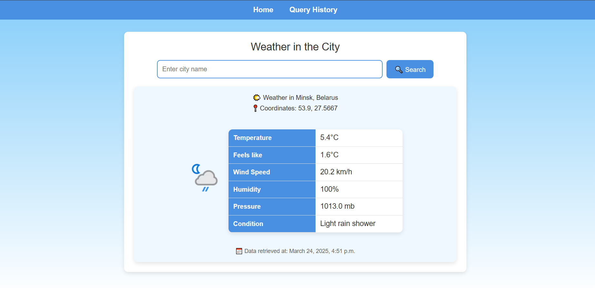

# Название проекта

Простое веб-приложение, позволяющее вводить название города, получать текущие данные о погоде, просматривать историю запросов.

_Технологии:_
- Python
- Django
- PostreSQL

## Установка

1. Клонируйте репозиторий:

   ```bash
   git clone https://github.com/kathlleen/weather_app.git
   cd weather_app

2. Создайте и активируйте виртуальное окружение:

Для Linux/macOS:


    python3 -m venv venv
    source venv/bin/activate

Для Windows:

```bash
python -m venv venv
.\venv\Scripts\activate
```

3. Установите зависимости из requirements.txt:

```bash
pip install -r requirements.txt
```
4. Создайте файл .env в корневой директории проекта и добавьте туда необходимые переменные окружения. Пример содержимого файла .env:

```env
SECRET_KEY=your_secret_key
DEBUG=True
DB_NAME=your_db_name
DB_USER=your_db_user
DB_PASSWORD=your_db_password
DB_HOST=localhost
DB_PORT=5432
API_KEY = "your_api_key"
```
Убедитесь, что у вас есть установленный PostgreSQL и создана база данных с указанным в .env именем.
API ключ нужно получить на сайте https://www.weatherapi.com/

5. Примените миграции базы данных:

```bash
python manage.py makemigrations
python manage.py migrate
```

6. Запустите сервер разработки:

```bash
python manage.py runserver
```

Теперь ваше приложение доступно по адресу http://127.0.0.1:8000/.

## Дополнительные настройки
В файле settings.py настроено подключение к базе данных PostgreSQL. Все параметры для подключения (имя базы данных, пользователь, пароль и т. д.) берутся из файла .env, чтобы обеспечить безопасность.
Для работы с PostgreSQL требуется установить библиотеку psycopg2, которая уже указана в requirements.txt.
Чтобы изменить конфигурацию базы данных или ключи, просто отредактируйте файл .env.

